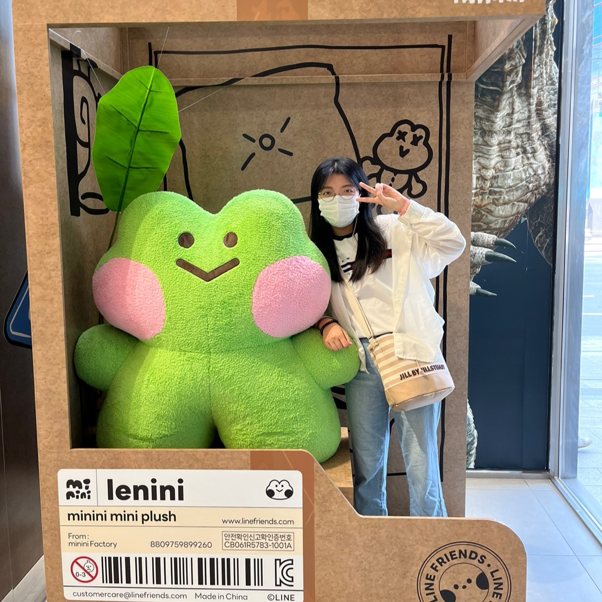
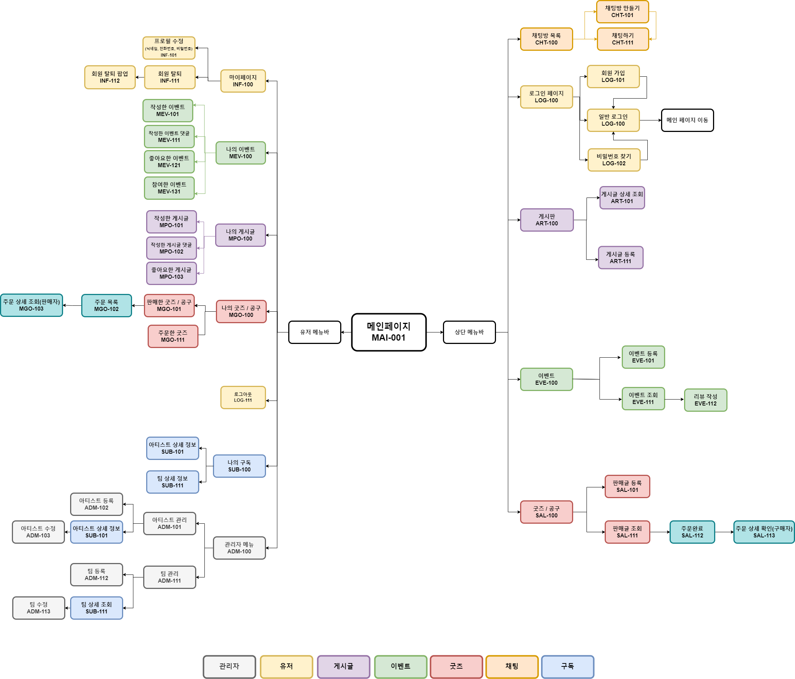

# 🎉 Happi_Day

## 🎈 프로젝트 주제

### 이벤트 홍보 및 굿즈 판매 등이 가능한 팬덤 커뮤니티 서비스

##  ⌛️ 프로젝트 요약

|    분류     |           내용            |  
|:---------:|:-----------------------:|
|    주제     |       엔터테인먼트 플랫폼        |
|    인원     |            4            |
|    기간     | 2023.07.11 ~ 2024.xx.xx |
|   배포 링크   |         업데이트 예정         |

##  📝️ 프로젝트 자료
|    분류     |                                                                        내용                                                                         |  
|:---------:|:-------------------------------------------------------------------------------------------------------------------------------------------------:|
|  프로젝트 문서  |                              [📚link](https://happiday.notion.site/Happi_Day-7e9965fe4d7a4b119049ae2930f88972?pvs=4)                              |
| 아키텍쳐 구성도  |                                   [📑link](https://happiday.notion.site/d5ab3ea30fbe4f10a07cd776609d2810?pvs=4)                                   |
|  기능 명세서   |                                   [📑link](https://happiday.notion.site/6af1a523aca947e887aa0f5d8e0c1fdc?pvs=4)                                   |
|  API 명세서  |                 [📑link](https://happiday.notion.site/3740cb4d5c8f49ec9dd1fb5e0488db77?v=083f18379ed547bb9a80d4d8f7938ad8&pvs=4)                  |
|  화면 흐름도   |                                   [📑link](https://happiday.notion.site/82fb24bbfe0246749de4fd78669df7e2?pvs=4)                                   |
| ER 다이어그램  |                                                                      업데이트 예정                                                                      |
| 시퀀스 다이어그램 |                                   [📑link](https://happiday.notion.site/d8eb4a7b49a44928952037145c14c3ce?pvs=4)                                   |
|   개발 내용   |                                  [📑link](https://happiday.notion.site/d6be269da16c49ca9ea8a41fe2eb7174?pvs=4)                                   |
|  Version  |                                                                      업데이트 예정                                                                      |
|  GitHub   |            [🌃back](https://github.com/Happi-Cat-Tiger/Happi-Day-Back), [🏙️front](https://github.com/Happi-Cat-Tiger/Happi-Day-Front)            |  

 

---

##  🔨개발 환경 - 기술 스택

<!-- 테스트 :    -->

개발 언어 : 

 
개발 프레임 워크: 

 
빌드 : 

 
API, 라이브러리 : 

 
데이터베이스 : 

 
배포 :

 
협업 : 

 
도구 :

 

--- 
## 👥 팀원 소개

<table>
  <tbody>
    <tr>
        <td align="center"> 팀장 </td>
        <td align="center"> 팀원 </td>
        <td align="center"> 팀원 </td>
        <td align="center"> 팀원 </td>
    </tr>
    <tr>
     <td>  </td>
     <td>  </td>
     <td>  </td>
     <td>  </td>

   </tr>
    <tr>
      <td align="center"><a href="https://github.com/greedyBackEnd"> 김도영 </a></td>
      <td align="center"><a href="https://github.com/sy-k-98"> 김소영 </a></td>
      <td align="center"><a href="https://github.com/2hapu"> 이용준 </a></td>
      <td align="center"><a href="https://github.com/csumin0825"> 최수민 </a></td>
    </tr>
  </tbody>
</table>

---

### 🏚️ 아키텍쳐 구성도

<!--
### ER 다이어그램

-->

### 🌊 플로우 차트

--- 
## ⚒️ 개발 내용

### 📦 굿즈 / 공구
- 로그인한 유저는 판매글을 작성할 수 있다.
    - 이미지는 S3에 저장된다.
    - 옵션을 등록/수정/삭제할 수 있다. 
    - 배달방법을 등록/삭제할 수 있다.
    - 해시태그는 아티스트, 팀, 해시태그로 구분하여 저장한다.
- 로그인한 유저는 본인의 판매글을 조회/수정/삭제할 수 있다.
  - 조회 시에는 구독 중인 아티스트 글만 보기 / 판매 중인 판매글 중 구독중인 아티스트 글만 보기 조회할 수 있다.
- 유저는 판매글에 찜하기 누르기/취소할 수 있다.
- 로그인한 유저는 판매글에서 주문할 수 있다.
  - 본인의 주문을 조회할 수 있다.
- 판매글 작성자는 판매글의 주문을 조회/상태 변경을 할 수 있다.

### 📝 게시판
- 로그인한 유저는 게시글을 작성할 수 있다.
  - 이미지는 S3에 저장된다.
  - 해시태그는 아티스트, 팀, 해시태그로 구분하여 저장한다.
- 로그인한 유저는 본인의 게시글을 조회/수정/삭제할 수 있다.
  - 조회 시에는 구독 중인 아티스트 글만 보기 조회할 수 있다.
- 유저는 게시글 좋아요 누르기/취소할 수 있다.
- 로그인한 유저는 게시글에 댓글을 작성할 수 있다.
  - 본인의 댓글을 수정/삭제할 수 있다.

### 👼 유저
- 회원가입, 로그인, 개인 정보 수정, 회원 탈퇴 기능을 제공한다.
- 비밀번호, 닉네임, 핸드폰 번호가 수정 가능하다.
- 비밀번호 변경 시 가입한 이메일을 통한 인증이 필요하다.
- 로그인 시 액세스 토큰과 레디스를 이용한 리프레시 토큰을 발급하여 로그인을 유지할 수 있다.

### 📬 채팅 
- WebSocket STOMP를 이용해 채팅을 전송한다.
- 사용자의 닉네임을 검색하여 채팅방을 생성한다.
- 채팅방 목록에서 기존 채팅방을 확인할 수 있다.
- 채팅방에 입장하면 채팅 내역을 확인할 수 있다.
- 읽지 않은 메시지 수를 확인할 수 있다.

### 🎉 이벤트
- 로그인한 유저는 이벤트를 작성할 수 있다.
- 이벤트 작성 시에는  이미지, 해시태그, 주소, 내용 등을 입력할 수 있다.
  - 썸네일 사진의 경우 입력하지 않는다면 S3에 저장된 기본 이미지로 등록된다.
  - 해시태그의 경우 입력받은 해시태그 문자열 목록을 처리하여, 특정 아티스트, 팀, 또는 일반 해시태그 중 어느 것에 해당하는지를 판별, 분류한다.
  - 주소의 경우 *외부API(예정)를 이용하여 도로명 주소를 입력받는다.
  - 이미지는 S3, 그 외 이벤트 내용은 Mysql에 저장된다.
- 이벤트 작성자의 경우 이벤트 수정 및 삭제가 가능하다.
  - 삭제에는 Soft Delete 방식이 적용되어, 데이터의 실제 제거 대신 삭제 여부를 표시하는 플래그를 업데이트하여 데이터가 삭제된 것처럼 관리된다.
- 로그인한 유저는 이벤트에 참가하기, 좋아요를 할 수 있다.
- 모든 사용자는 이벤트를 조회할 수 있다.
  - 필터링으로 구독한 아티스트/팀 및 진행 중인 이벤트를 조회할 수 있다.
  - 원하는 이벤트를 검색하여 찾을 수 있다.
  - 이벤트 상세 조회 시 Redis를 활용하여 이벤트 조회수를 관리한다.
    - 사용자의 IP와 이벤트 ID를 조합한 고유 키로 24시간 동안 중복 조회를 방지한다.
- 로그인한 유저는 이벤트에 댓글 작성을 할 수 있다.
  - 댓글 작성자의 경우 댓글을 수정/삭제할 수 있다.

### 🪄 이벤트 리뷰
- 로그인한 유저는 이벤트에 리뷰를 작성할 수 있다.
  - 이벤트가 진행이 된 후에 리뷰 작성이 가능하다.
  - 유저는 하나의 이벤트에 하나의 리뷰만 작성할 수 있다.
  - 이미지의 경우 최대 x 개까지 첨부 가능하다. *미정*
  - 이미지는 S3, 그 외 리뷰 내용 및 별점은 Mysql에 저장된다.
- 리뷰 작성자의 경우 리뷰 수정 및 삭제가 가능하다.
  - 삭제에는 Soft Delete 방식이 적용되어, 데이터의 실제 제거 대신 삭제 여부를 표시하는 플래그를 업데이트하여 데이터가 삭제된 것처럼 관리된다.

### 🧸 팀 / 아티스트 구독
- 유저는 관심 있는 아티스트를 구독할 수 있습니다.
  - 아티스트의 간단한 정보와 이미지 등을 열람할 수 있습니다.
  - 구독된 아티스트와 관련된 이벤트 및 상품 등을 조회할 수 있습니다.
  - 구독된 아티스트를 기준으로 게시글을 필터링할 수 있습니다.
- 관리자는 아티스트를 관리할 수 있습니다.
  - 관리자는 팀 및 아티스트의 등록 및 수정, 삭제 권한을 갖습니다.
  - 아티스트 등록 시, 소속 여부에 따라 팀과 연관 관계를 맺습니다.

---
<!--
### 🔼 버전 정보

#### 1️⃣ Ver 1.0 (24/xx/xx)
- 
-

#### 2️⃣ Ver 1.1 (24/xx/xx)
- 
-

-->